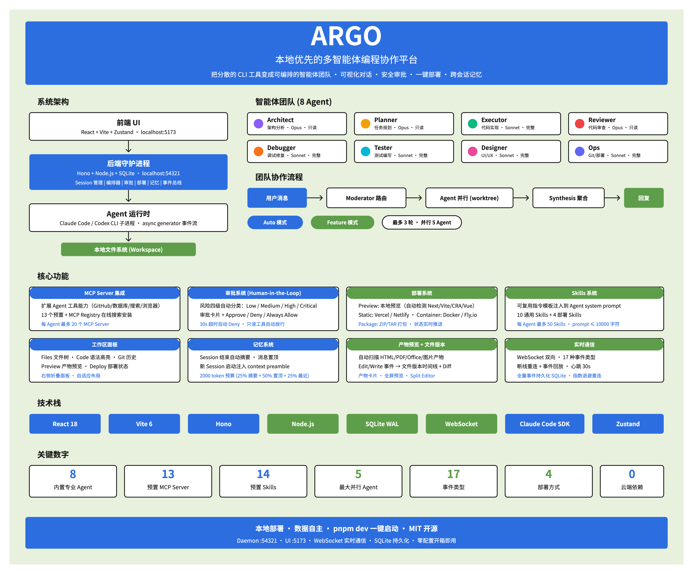

# Argo

[English](./README.md) | [中文](./README.zh-CN.md)

本地优先的多智能体编程协作平台。Argo 将 AI 编程 CLI 工具（Claude Code、Codex）封装为可视化智能体，提供统一界面来编排它们在本地项目中协同工作。



## Argo 是什么？

与传统 AI 编程助手直接调用 LLM API 不同，Argo 通过 SDK 的 async generator 将 Claude Code CLI / Codex CLI 作为子进程运行。每个 Agent 继承 CLI 工具的全部能力（文件操作、命令执行、代码搜索），同时 Argo 提供可视化、团队编排和安全控制的上层能力。

**核心能力：**

- **可视化对话** — 流式展示 Agent 的思考过程、工具调用和产出物，替代纯文本终端体验
- **多 Agent 协作** — 8 个专业化内置 Agent + 自定义 Agent，由 Moderator 自动编排分工，支持并行执行 + git worktree 分支隔离
- **安全审批** — 风险四级分类（Low/Medium/High/Critical），高危操作实时弹出审批卡片，30s 超时自动拒绝
- **上下文记忆** — 自动会话摘要 + 消息置顶 + 上下文注入，跨 session 保持工作连续性
- **一键部署** — 对话中生成的代码可直接本地预览、部署到 Vercel/Netlify/Docker/Fly.io、或打包下载
- **MCP 扩展** — 通过 Model Context Protocol 服务器无限扩展 Agent 工具能力（GitHub/数据库/搜索/浏览器等）

## 系统架构

```
前端 (localhost:5173)
    │  React 18 + Vite + Zustand + TailwindCSS
    │
    ▼  WebSocket + REST
守护进程 (localhost:54321)
    │  Hono + Node.js + SQLite (WAL)
    │
    ▼  Claude Code SDK / Codex SDK
Agent CLI 子进程
```

所有数据存储在本地 SQLite，无云端依赖。

## 内置智能体

| Agent | 职责 | 模型 | 权限 |
|-------|------|------|------|
| **Architect** | 代码分析、Bug 诊断、架构建议 | Opus | 只读 |
| **Planner** | 需求分析、任务分解、工作规划 | Opus | 只读 |
| **Executor** | 最小化 diff 的代码实现 | Sonnet | 完整 |
| **Reviewer** | 规格合规、安全检查、代码质量审查 | Opus | 只读 |
| **Debugger** | 系统性 Bug 调查与修复 | Sonnet | 完整 |
| **Tester** | 全面测试编写（正常路径 + 边界情况） | Sonnet | 完整 |
| **Designer** | UI/UX 实现、响应式设计、可访问性 | Sonnet | 完整 |
| **Ops** | Git 操作、分支管理、CI/CD、部署 | Sonnet | 完整 |

## 团队协作

当多个 Agent 参与同一对话时：

1. 用户发送消息
2. Moderator 分析任务并 @mention 所需的 Agent
3. Agent 并行执行（最多 5 个并发），各自在独立的 git worktree 中工作
4. 结果合并后生成综合回复
5. 每条用户消息最多 3 轮 Agent 协作

**团队预设：**
- **Auto** — Moderator 拥有完全自主权决定调用哪些 Agent
- **Feature** — 结构化流水线：澄清 → 规划 → 实现 → 测试 → 审查 → 提交

## 环境要求

- Node.js >= 22.0.0
- pnpm >= 9
- [Claude Code CLI](https://docs.anthropic.com/en/docs/claude-code)（已完成 OAuth 认证）
- Git（多 Agent 并行需要 worktree 支持）
- Codex CLI（可选的备选运行时）

## 快速开始

```bash
# 克隆仓库
git clone https://github.com/ashuiGordon/argo.git
cd argo

# 安装依赖
pnpm install

# 启动开发服务器（守护进程 + UI）
pnpm dev
```

启动后：
- UI 界面：http://localhost:5173
- 守护进程 API：http://localhost:54321
- WebSocket：ws://localhost:54321/ws

首次访问时系统自动创建开发用户，无需注册。

## 项目结构

```
packages/
  shared/     # 共享类型、Schema、常量
  daemon/     # 后端：API 路由、编排器、会话管理、
              # 审批系统、事件总线、记忆系统、部署管理器
  ui/         # 前端：React SPA，包含对话界面、工作区面板、
              # 智能体管理、审批卡片、部署 UI
avatars/      # Agent 头像图片
```

## 脚本命令

```bash
pnpm dev        # 开发模式启动守护进程 + UI
pnpm build      # 构建所有包（生产版本）
pnpm test       # 运行测试
pnpm typecheck  # TypeScript 类型检查
pnpm lint       # ESLint 检查
pnpm format     # Prettier 格式化
```

## 环境变量

| 变量 | 用途 | 必填 |
|------|------|------|
| `ANTHROPIC_API_KEY` | 会话摘要生成（调用 Claude API） | 可选* |

\* Agent 执行本身不需要此变量 — Claude Code CLI 自行管理认证。未设置时摘要将使用本地 fallback 方法。

## 核心功能

### MCP 服务器集成

通过 MCP（Model Context Protocol）服务器扩展 Agent 能力：
- 12 个预配置服务器（filesystem、git、github、postgres、sqlite、brave-search、puppeteer、slack、memory、fetch 等）
- 从 MCP Marketplace 浏览安装或搜索 MCP Registry
- 每个 Agent 最多 20 个 MCP 服务器

### Skills 系统

注入到 Agent system prompt 的可复用指令模板：
- 12 个内置通用 Skills（code-review、write-tests、refactor、debug 等）
- 4 个部署 Skills（preview、static、container、package）
- 每个 Agent 最多 50 个 Skills，每个 prompt 最长 10,000 字符

### 审批系统

所有 Agent 的工具调用都经过风险分类器：
- **自动允许（Low）：** Read、Glob、Grep、WebSearch 等
- **中等（Medium）：** 文件写入/编辑、一般 Bash 命令
- **高危（High）：** 操作敏感文件（.env、credentials）
- **严重（Critical）：** `rm -rf`、`DROP TABLE`、`git push --force` 等

支持配置 "Always Allow" 规则简化重复安全操作的审批流程。

### 部署系统

对话中支持 4 种部署方式：
- **Preview** — 本地开发服务器，自动检测框架
- **Static** — 部署到 Vercel 或 Netlify
- **Container** — Docker 构建 + Fly.io 部署
- **Package** — 打包为 tar/zip 归档下载

## 许可证

Private
